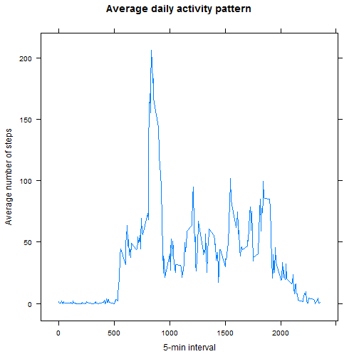
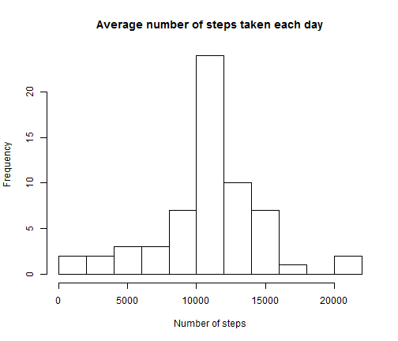

Reproducible Research - project 1
========================================================

Let's first load the data:


```r
#loading the data
d <- read.csv("activity.csv")
```

```
## Warning in file(file, "rt"): cannot open file 'activity.csv': No such file
## or directory
```

```
## Error in file(file, "rt"): cannot open the connection
```

## 1. Number of steps
### 1.1 Histogram of the total number of steps taken each day.


```r
# creating a new variable with the total number of steps for each day (1 day = 1 date, with different 5-min intervals)
stepday <- tapply(d$steps, d$date, sum, na.rm = TRUE)
```


```r
hist(stepday, breaks = 15,main = "Average number of steps taken each day", xlab ="Number of steps")
```

 

### 1.2 Mean and median


```r
summary(stepday)
```

```
##    Min. 1st Qu.  Median    Mean 3rd Qu.    Max. 
##       0    6778   10400    9354   12810   21190
```
The mean number of steps taken each day is **9354** steps and the median is **10400** steps.


## 2. Daily activity pattern
### 2.1 Time series plot
Here is a time series plot of the average number of step taken for each 5-min interval.


```r
# changing the class of "interval" to a factor
d$interval <- as.factor(d$interval)
# computing the average number of steps per interval 
meansteps <- tapply(d$steps,d$interval,mean, na.rm = TRUE)
# creating a new data frame with the correct information
DA <- data.frame(interval = levels(d$interval), steps = meansteps)
#changing the class of the interval variable back to an integer
DA$interval <- as.character(DA$interval) #necessary intermediary step
DA$interval <- as.numeric(DA$interval)

# plot
library(lattice)
xyplot(DA$steps ~ DA$interval, type = "l", main = "Average daily activity pattern", xlab = "5-min interval", ylab = "Average number of steps")
```

 

### 2.2 Interval and maximum number of steps

```r
# finding the required interval
subset(DA, DA$steps == max(DA$steps))
```

```
##     interval    steps
## 835      835 206.1698
```
On average across all the days in the dataset, the 5-min interval which contains the maximum number of steps averaged across all days (206.170) is the **835** minutes interval.


## 3.Inputing missing values
### 1. Number of missing values

```r
summary(d)
```

```
##      steps                date          interval    
##  Min.   :  0.00   2012-10-01:  288   0      :   61  
##  1st Qu.:  0.00   2012-10-02:  288   5      :   61  
##  Median :  0.00   2012-10-03:  288   10     :   61  
##  Mean   : 37.38   2012-10-04:  288   15     :   61  
##  3rd Qu.: 12.00   2012-10-05:  288   20     :   61  
##  Max.   :806.00   2012-10-06:  288   25     :   61  
##  NA's   :2304     (Other)   :15840   (Other):17202
```
There are **2304** missing values in the data set.

### 2. Strategy to fill in the missing values
We will replace the missing values with the mean number of steps for the particular 5-min interval, averaged across all days. 

### 3. New dataset with missing values filled in
Here is the code to create this new data set.

```r
d1 <- d #creating a new dataset, equal to the other dataset
for (i in (1:nrow(d1))){   #taking each row in turn
    if (is.na(d1[i,1])){   #checking if missing value
        #computing mean for 5-min interval
        newVal <- mean(d1$steps, 
                       data = subset(d1, d1$interval == d1[i,3]),
                       na.rm = TRUE) 
        #replacing missing value by new value
        d1[i,1] <- newVal    
    }   #end of if loop
}       #end of for loop
```

Let's check that there are no missing values in the new dataset:

```r
summary(d1)
```

```
##      steps                date          interval    
##  Min.   :  0.00   2012-10-01:  288   0      :   61  
##  1st Qu.:  0.00   2012-10-02:  288   5      :   61  
##  Median :  0.00   2012-10-03:  288   10     :   61  
##  Mean   : 37.38   2012-10-04:  288   15     :   61  
##  3rd Qu.: 37.38   2012-10-05:  288   20     :   61  
##  Max.   :806.00   2012-10-06:  288   25     :   61  
##                   (Other)   :15840   (Other):17202
```

### 4. Number of steps per day
Here is a histogram of the number of steps taken per day with the new dataset with no missing value.


```r
# new variable with total number of steps per day
stepday1 <- tapply(d1$steps, d1$date, sum)
```


```r
hist(stepday1, breaks = 15,main = "Average number of steps taken each day", xlab ="Number of steps")
```

 

Mean and median:

```r
summary(stepday1)
```

```
##    Min. 1st Qu.  Median    Mean 3rd Qu.    Max. 
##      41    9819   10770   10770   12810   21190
```
The mean number of steps taken each day is **10770** steps and the median is **10770** steps.
These numbers are close to the estimates from the first part of the assignment, but not equal to them. The mean notably is higher from the first estimate by 1400 steps. Inputing missing values has reduced the variability in the data, and increased the mean. 

## 4. Are there differences in activity patterns between weekdays and weekends?

### 1. Differentiating between weekdays and weekends

```r
# puting the date in the right format
d1$date <- strptime(d1$date, "%Y-%m-%d")
#new variable with day of the week
d1$day <- weekdays(d1$date)
#new categorical variable with 2 levels
d1$daytype <- ifelse(!weekdays(d1$date) %in% c("samedi", "dimanche"),"weekday","weekend")
        #these are the French words for "Saturday" and "Sunday". As my system is in French, those are the names returned by the weekdays() function. Hope this won't be a problem on other systems.
d1$daytype <- factor(d1$daytype)
```

### 2. Panel plot


```r
# changing the class of "interval" to a factor
d1$interval <- factor(d1$interval)
#computing the average number of steps per interval and per day type
meansteps2 <- tapply(d1$steps, list(d1$interval, d1$daytype), mean)
#reformating the data
WD <- data.frame(interval = levels(d1$interval), steps = meansteps2[,1], dayType = "weekday")
WE <- data.frame(interval = levels(d1$interval), steps = meansteps2[,2], dayType = "weekend")
#new dataset with right values
StepsDayType <- rbind(WD,WE)
#putting "interval" back in the right format
StepsDayType$interval <- as.character(StepsDayType$interval)
StepsDayType$interval <- as.numeric(StepsDayType$interval)
```


```r
xyplot(steps ~ interval | dayType, data = StepsDayType, type = "l", xlab = "5-min Interval", ylab = "Average number of steps", main = "Activity patterns for weekdays and weekends")
```

 
